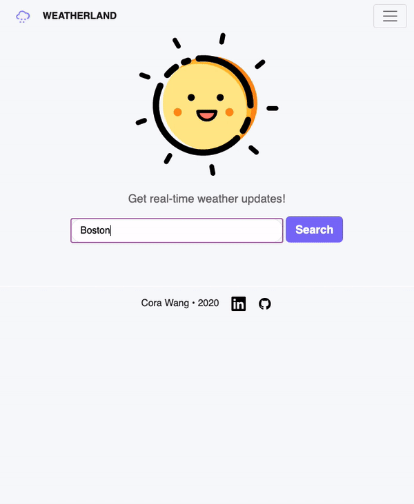

# Weatherland
#### Author: Cora Wang
Last Update: Sep 2020

Project to check real-time weather info.

The project is developed mainly in `Node.js` with `Express` webserver and templated with `Handlebars`



The project fetches the geographic location via [Mapbox](https://www.mapbox.com/) and the real-time weather status from [weatherstack](weatherstack.com).
Both sites provide free API with limited data access.

Visit the production site at [Weatherland](https://cw-weatherland.herokuapp.com)!

### To run this project
First clone the project to your local machine
```git clone https://github.com/wcora/weatherland.git```

Then install all dependencies via ```npm install```

Then run the starting script ```npm run dev```

This app is currently deployed to Heroku at [Weatherland](https://cw-weatherland.herokuapp.com)!


